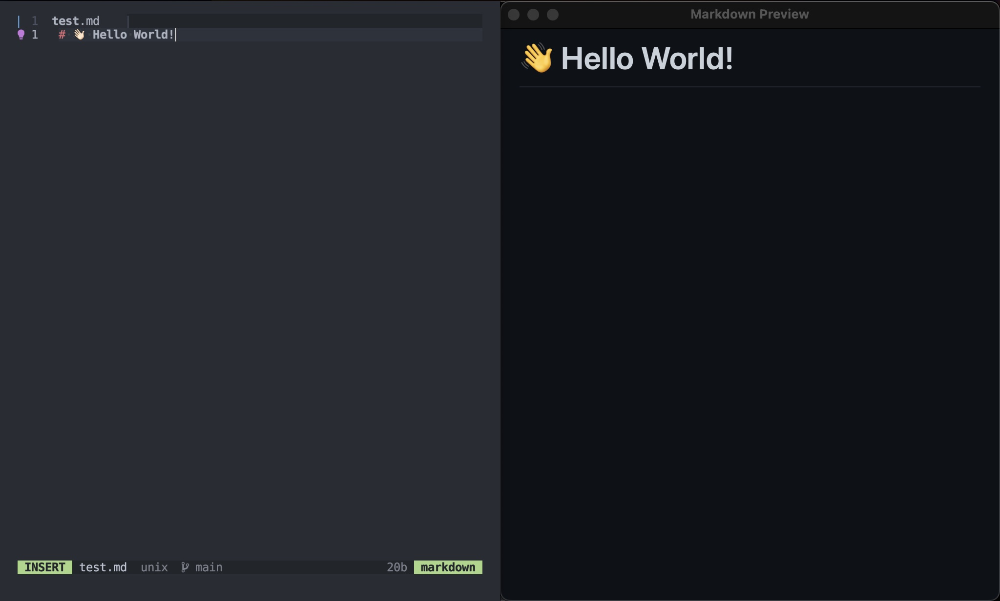

# markdown-preview-ls

A markdown preview tool implementing the language server protocol.



<br><br>

## neovim setup

`lua/lspconfig/server_configurations/markdown_preview_ls.lua`
```lua
local util = require('lspconfig.util')
local bin_name = 'markdown-preview-ls'

return {
  default_config = {
    cmd = { bin_name },
    filetypes = { 'markdown' },
    root_dir = util.root_pattern('README.md', '.git'),
  },
  commands = {
    OpenPreview = {
      function()
        vim.lsp.buf.execute_command({
          command = 'mardown-preview.open',
          arguments = { { textDocument = vim.lsp.util.make_text_document_params(0) } },
        })
      end,
      description = 'Open Markdown Preview',
    },
    UpdatePreview = {
      function()
        vim.lsp.buf.execute_command({
          command = 'mardown-preview.update',
          arguments = { { textDocument = vim.lsp.util.make_text_document_params(0) } },
        })
      end,
      description = 'Update Markdown Preview',
    },
    ClosePreview = {
      function()
        vim.lsp.buf.execute_command({
          command = 'mardown-preview.close',
          arguments = {},
        })
      end,
      description = 'Close Markdown Preview',
    },
  },
}
```

`init.lua`
```lua
require('lspconfig')markdown_preview_ls.setup({})
```

<br>

**Switch to focused buffer:**

```lua
vim.api.nvim_create_autocmd('BufEnter', {
  pattern = { '*.md' },
  command = 'silent! UpdatePreview',
})
```

<br><br>


## License

[MIT © Josa Gesell](LICENSE)

